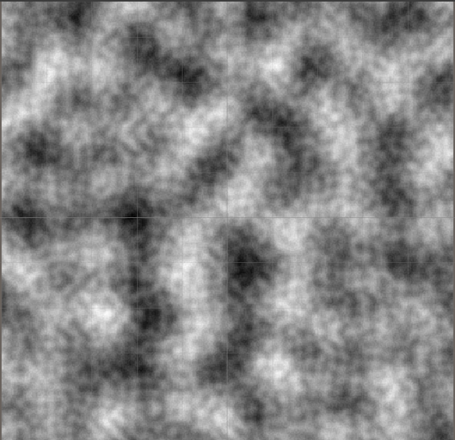
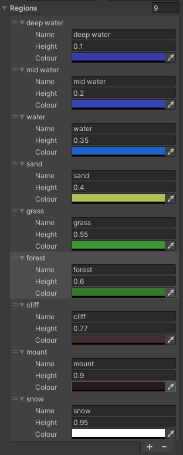
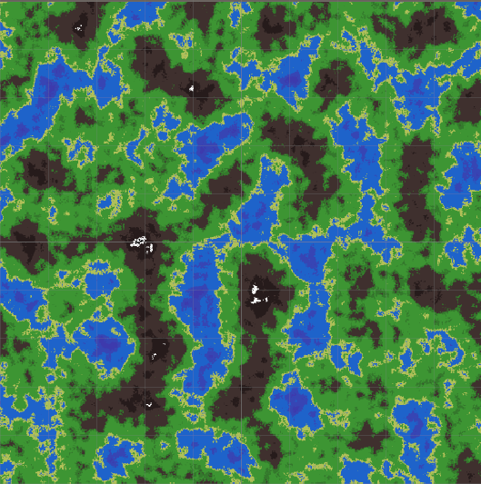

# Procedural environnnement

## But
Le but de ce projet est de créer un generateur procédural d'environnnement<br>
virtuel. Qui servira à la generation de terrain en 2D.

## Installation

### Prérequis
---
Pour pouvoir utilisé l'application il faut tout d'abord installé unity.
Et la librérie C# qui contient toute les classes dédié à unity, c'est pour cela que je vous conseille d'utilisé l'IDE visual studio 2022<br> 
car il  contient un runtime C# et les librérie neccessaire à l'utilisation de unity.

### Commandes
---
Pour installer le repo tapez les commandes suivante dans git bash :
```bash 
    mkdir projetTropCool
    cd projectTropCool
    git init --initial-branch=perlinMap
    git remote add origin "https://github.com/anulax1225/unitygamecreation.git"
    git pull origin perlinMap
```
Puis ouvrez le unity hub et ouvré le dossier depuis celui-ci.

## Fonctionnement

### Le bruit de perlin
---
Se projet est principalement basé sur un type de bruit bien<br>
particulier, le bruit de perlin. Il s'agit d'un bruit comme le bruit blanc qui forme des image de bruit qui on des patterns bien précise mais qui ne se répaît jamais.<br>
Un exemple :
<div align="center">
    
</div>
<br>
Puis l'on par du principe que sur le plan en deux dimension plus un point est foncé plus il est hauteur sur la carte<br>
donc on peux créer une variation des couleurs en fonction de la hauteur du terrain. La hauteur du terrain à été normalizé à une valeur entre 0-1.<br>
Pour le représenté à C# j'ai décidé d'utilisé un struct de type de terrain puis dans faire un table. 
Donc j'ai choisi ces paramètres:
<div align="center">
    
</div>
<br>
Et voilà le résultat pour la même carte que au dessus :
<div align="center">
    
</div>
<br>
Il y a tout un tas d'autre paramètres avec les quels joué pour obtenir des formes et des terrains différentes. 

### Les paramètres
---
* Draw Mode:
* Map Width:
* Map Height:
* Noise Scale:
* Persistance:
* Octaves:
* Lacunarity:
* Seed:
* Offset: 
* Regions:

